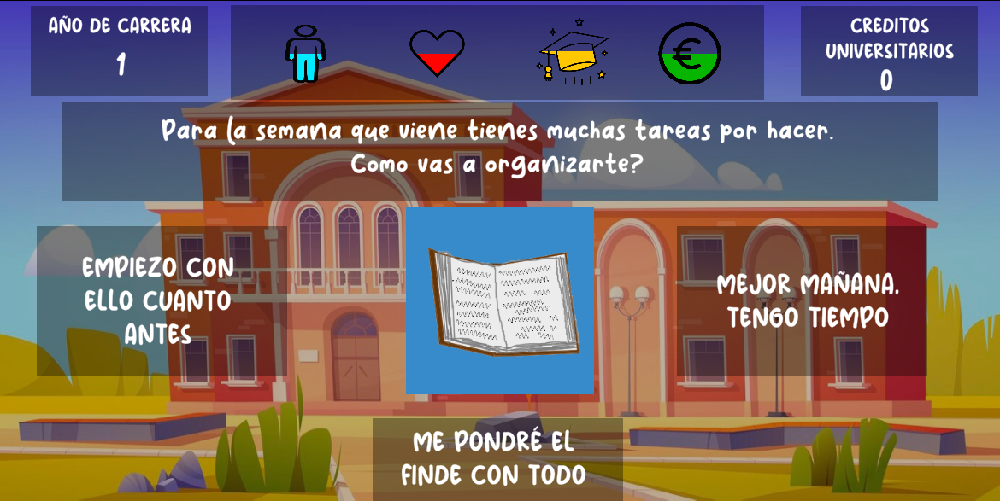

# Universities
Juego de Estrategia en el que el jugador tiene que tomar una serie de
decisiones que van afectando a diferentes aspectos de su vida y mantener
un equilibrio entre su vida social, su bienestar, su rendimiento
académico y sus finanzas, el suficiente tiempo hasta que el jugador
consiga graduarse de su carrera.

Con este juego, buscamos concienciar sobre la vida estudiantil
específicamente a gente alrededor de los estudiantes como los padres o
el profesorado. Tambien queremos aportar diferentes perspectivas para
superar algunas situaciones que se pueden haber dado en algunos
estudiantes y que estos tengan una pequeña ayuda para enfrentarlas.

